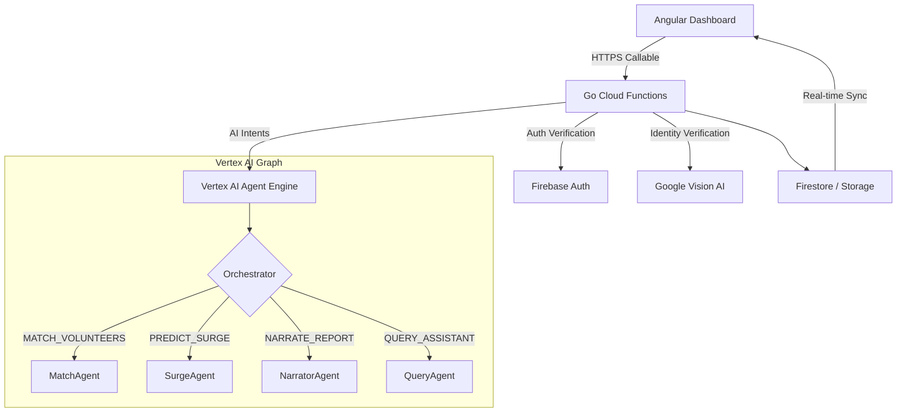

# Sahaay (सहाय) — Smart Resource Allocation for Mumbai NGOs

Sahaay is a web-spp, offline-capable platform designed to streamline humanitarian efforts in Mumbai. It connects field workers, volunteers, and NGO administrators through a real-time coordination layer powered by Vertex AI and secured by Aadhaar-linked identity verification.

---

## 🚀 The Mission

**Problem:** NGOs in high-density areas like Dharavi, Kurla, and Govandi manage critical needs via fragmented WhatsApp groups and paper logs. Manual volunteer matching is slow, and surge needs (monsoon floods, medical spikes) are often reactive rather than predictive.

**Solution:** A unified operational dashboard featuring:
- **Real-time Needs Map:** Live tracking of food, medical, and shelter needs with heatmaps.
- **AI-Powered Matching:** Vertex AI agents that rank volunteers based on proximity, skills, and availability.
- **Identity Trust:** Secure NGO and volunteer onboarding using Aadhaar KYC and Face Matching.
- **Surge Prediction:** Predictive analytics for anticipated resource spikes in specific Mumbai clusters.

---

## 🛠 Tech Stack

| Layer | Technology |
| :--- | :--- |
| **Frontend** | Angular 18 (Signals, Standalone, Material 3) |
| **Backend** | Go (Cloud Functions), Firebase (Auth, Firestore, Storage) |
| **Intelligence** | Vertex AI Agent Engine (Gemini 2.0 Flash) |
| **Security** | Firebase App Check (reCAPTCHA v3), Identity Verification (Aadhaar OCR) |
| **Maps** | Google Maps JS API (Heatmaps, Proximity Rings) |

---

## 📂 Architecture Overview

Sahaay uses a **Federated Multi-Agent Graph** architecture. All critical logic (AI, Identity, Security) is centralized in Go Cloud Functions to prevent client-side tampering.

### System Flow

---

## 🛡 Security & Compliance

Sahaay implements strict security protocols:
1. **Identity Verification:** All NGO founders and volunteers must pass Aadhaar-linked KYC.
2. **App Check:** Enforced at the infrastructure level to block unauthorized API traffic.
3. **Role-Based Access:** Granular permissions for Field Workers, Volunteers, Admins, and Founders.
4. **Data Sovereignty:** Firestore security rules ensure data is only accessible to authorized organizational members.

---

## 📄 Documentation

- [AGENTS.md](./AGENTS.md) — Detailed AI architecture and absolute development rules.
- [DESIGN.md](./DESIGN.md) — Design system, tokens, and UI components.
- [IMPLEMENTATION_SUMMARY.md](./IMPLEMENTATION_SUMMARY.md) — High-level feature roadmap and technical achievements.

---

© 2026 Sahaay Team. Built for Mumbai, by SideQuest.
